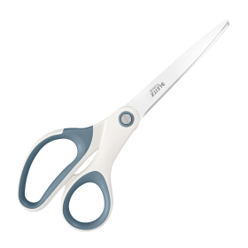

# 🏓 Ping Pong AI Game (Python + Pygame)


A **Ping Pong game** built using Python (Pygame) with an intelligent AI opponent and special power-ups like Fire, Ice, and Scissors that make the gameplay more dynamic and fun.

---

# 🎮 Features

### 🧠 AI Opponent
- AI uses smart movement (BFS logic) to track the ball.
- Adaptive difficulty during gameplay.

---

### 🔥 Power-ups System

- 🔥 **Fire** → increases ball speed
- ❄️ **Ice** → freezes opponent temporarily
- ✂️ **Scissors** → reduces paddle size

---

### 🎮 Classic Gameplay
- Player vs AI
- Mouse-controlled paddle
- Score system
- Real-time physics

---

# 🖥️ Game Screenshots

---

## 🏁 Start Screen


---

## 🏓 Gameplay

<p align="center">
  
  
</p>

<p align="center">
  
  
</p>

---

## ⚡ Power-ups in Game

<p align="center">
  
  
  
</p>

---

# ⚙️ Requirements

- Python 3.x
- Pygame

### Install dependencies:
```bash
pip install pygame
